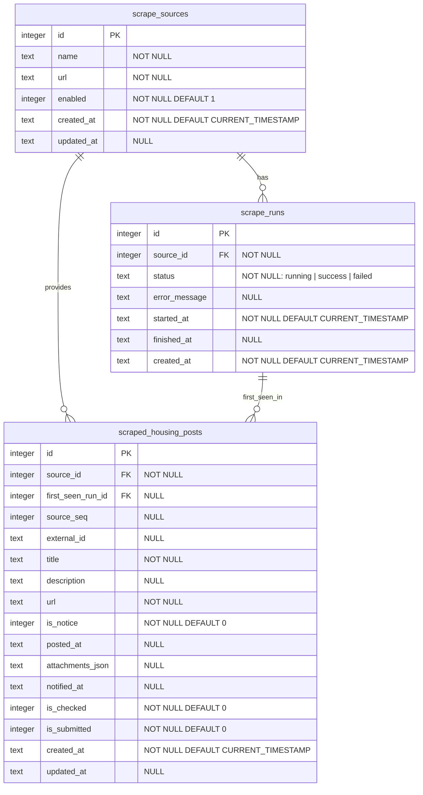

# Database Schema

This project uses SQLite as a local runtime database. The database file is runtime data and must not be committed to Git.

Schema target app version: `1.0.0`

## ERD



## Tables

### `scrape_sources`

Defines scrape targets such as public housing announcement boards.

```sql
CREATE TABLE scrape_sources (
  id INTEGER PRIMARY KEY,
  name TEXT NOT NULL,
  url TEXT NOT NULL,
  enabled INTEGER NOT NULL DEFAULT 1 CHECK (enabled IN (0, 1)),
  created_at TEXT NOT NULL DEFAULT CURRENT_TIMESTAMP,
  updated_at TEXT
);
```

### `scrape_runs`

Stores execution history for each scrape source. Source health is intentionally not stored here; it is calculated in the service layer from recent run history.

```sql
CREATE TABLE scrape_runs (
  id INTEGER PRIMARY KEY,
  source_id INTEGER NOT NULL,
  status TEXT NOT NULL CHECK (status IN ('running', 'success', 'failed')),
  error_message TEXT,
  started_at TEXT NOT NULL DEFAULT CURRENT_TIMESTAMP,
  finished_at TEXT,
  created_at TEXT NOT NULL DEFAULT CURRENT_TIMESTAMP,

  FOREIGN KEY (source_id) REFERENCES scrape_sources(id)
);
```

### `scraped_housing_posts`

Stores housing-related scraped posts and the user's tracking state.

```sql
CREATE TABLE scraped_housing_posts (
  id INTEGER PRIMARY KEY,
  source_id INTEGER NOT NULL,
  first_seen_run_id INTEGER,
  source_seq INTEGER,
  external_id TEXT,
  title TEXT NOT NULL,
  description TEXT,
  url TEXT NOT NULL,
  is_notice INTEGER NOT NULL DEFAULT 0 CHECK (is_notice IN (0, 1)),
  posted_at TEXT,
  attachments_json TEXT,
  notified_at TEXT,
  is_checked INTEGER NOT NULL DEFAULT 0 CHECK (is_checked IN (0, 1)),
  is_submitted INTEGER NOT NULL DEFAULT 0 CHECK (is_submitted IN (0, 1)),
  created_at TEXT NOT NULL DEFAULT CURRENT_TIMESTAMP,
  updated_at TEXT,

  FOREIGN KEY (source_id) REFERENCES scrape_sources(id),
  FOREIGN KEY (first_seen_run_id) REFERENCES scrape_runs(id),
  UNIQUE (source_id, url)
);
```

## Suggested Indexes

```sql
CREATE INDEX idx_scrape_runs_source_started_at
ON scrape_runs (source_id, started_at DESC);

CREATE INDEX idx_scraped_housing_posts_source_created_at
ON scraped_housing_posts (source_id, created_at DESC);

CREATE INDEX idx_scraped_housing_posts_checked
ON scraped_housing_posts (is_checked, created_at DESC);

CREATE INDEX idx_scraped_housing_posts_submitted
ON scraped_housing_posts (is_submitted, created_at DESC);
```

## Source Health Rule

Source health is derived in the service layer from recent `scrape_runs` rows.

Recommended v1 rule:

```text
no run history                 -> unknown
latest run is success          -> healthy
latest run is failed           -> degraded
latest 3 runs are all failed   -> unhealthy
```

This keeps the database focused on facts and avoids storing derived health state that can drift from run history.
